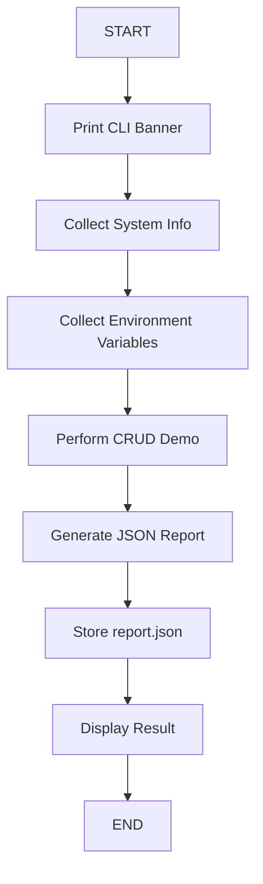

# Task Flow — Thunder Hackathon 3.0  

## Execution Flow

```
START
  ↓
Print CLI Banner
  ↓
Collect System Info        ← collector.js (os, cpu, node, memory)
  ↓
Collect Environment Variables  ← envCollector.js (USER, USERNAME, HOME, PATH)
  ↓
Perform CRUD Demo          ← fileManager.js (create → read → update → delete)
  ↓
Generate JSON Report       ← formatter.js (build report object)
  ↓
Store report.json          ← formatter.js (save to output/report.json)
  ↓
Display Result             ← formatter.js (colored console output + summary)
  ↓
END
```

---

## Mermaid Diagram



---

## Detailed Step Breakdown

### 1. START
Application launched via `node src/index.js`. Execution timer starts.

### 2. Print CLI Banner
`formatter.printBanner()` displays a colored ASCII banner using `chalk`.

### 3. Collect System Info
`collector.collectAllSystemInfo()` gathers:
- **OS**: type, release, platform, hostname (via `os` module)
- **CPU**: architecture, model, core count (via `os` module)
- **Node**: version, home dir, cwd, uptime (via `process` module)
- **Memory**: total, free, used in MB (via `os` module)

### 4. Collect Environment Variables
`envCollector.collectEnvVariables()` reads:
- `USER`, `USERNAME`, `HOME`, `PATH` from `process.env`
- Returns `"Not Available"` for any missing variable

### 5. Perform CRUD Demo
`fileManager.runCrudDemo()` executes in `workspace/`:
- **CREATE**: `createFile()` → writes `workspace/sample.txt`
- **READ**: `readFile()` → reads `sample.txt` content
- **UPDATE**: `updateFile()` → appends ISO timestamp
- **READ (verify)**: reads again to confirm update
- **DELETE**: `deleteDemoFile()` → removes only `workspace/temp.txt`

### 6. Generate JSON Report
`formatter.buildReport()` assembles:
```json
{
  "timestamp": "...",
  "system": { ... },
  "environment": { ... },
  "crudDemo": { ... },
  "summary": { ... }
}
```

### 7. Store report.json
`formatter.saveReport()` writes `output/report.json` using `JSON.stringify(data, null, 2)`.

### 8. Display Result
`formatter.printReport()` outputs all sections in color with summary statistics and execution duration.

### 9. END
Application exits cleanly. Exit code 0 on success, 1 on fatal error.
